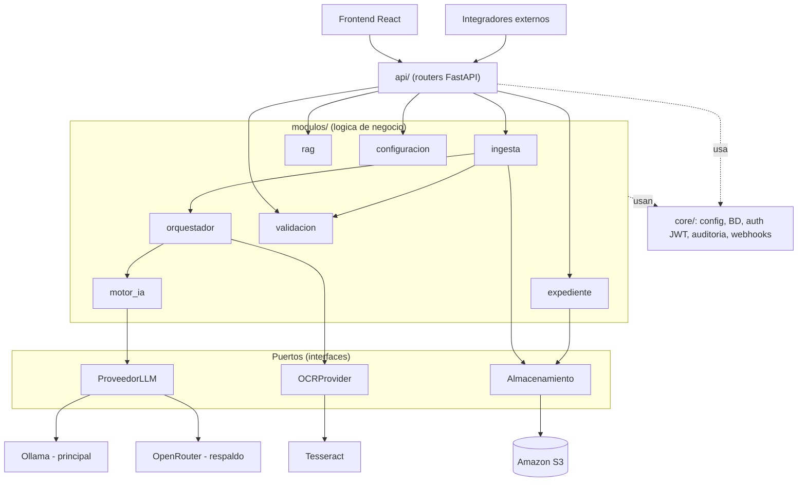

# Arquitectura de software

Monolito modular con puertos y adaptadores (ADR-005). Una sola aplicacion FastAPI dividida en modulos
independientes; los servicios externos se usan siempre a traves de una interfaz.

## Vista general



## Capas

| Capa | Donde | Que hace | Que NO hace |
|---|---|---|---|
| Entrada | `modulos/api/` | Recibe HTTP, valida con Pydantic, comprueba rol, llama a un servicio | Logica de negocio ni SQL |
| Modulos | `modulos/<modulo>/servicio.py` | Logica de negocio del modulo | Usar librerias externas directamente |
| Puertos | `interfaces.py` o el `Protocol` de cada adaptador | Definen que se necesita de fuera | Implementacion |
| Adaptadores | `core/almacenamiento.py`, `orquestador/ocr.py`, `motor_ia/proveedores/*.py` | Hablan con S3, Tesseract, Ollama, OpenRouter | Logica de negocio |
| Compartido | `core/` | Config, sesion de BD y modelos, auth, auditoria, webhooks | Importar modulos |

## Puertos y adaptadores

| Puerto | Definido en | Adaptador real | Adaptador de test / stub |
|---|---|---|---|
| `Almacenamiento` | `core/almacenamiento.py` | `AlmacenamientoS3` (boto3, Amazon S3) | `moto` en pytest |
| `OCRProvider` | `orquestador/ocr.py` | `TesseractOCR` | OCR falso con texto fijo |
| `ProveedorLLM` | `motor_ia/interfaces.py` (Contrato 3) | `OllamaProvider`, `OpenRouterProvider` | Respuestas guardadas en `tests/respuestas_modelo/` |

## Estructura de un modulo

```
modulos/<modulo>/
  README.md        contrato de entrada/salida
  servicio.py      API publica del modulo: lo unico que importan los demas
  repositorio.py   consultas a BD del modulo (si las tiene)
  esquemas.py      modelos Pydantic internos (si hacen falta)
```
Se crean solo los ficheros que el modulo necesite. Los contratos de `resultado.py` siguen siendo
los modelos compartidos.

## Reglas de dependencia
1. `api` llama a los `servicio.py` de los modulos; nunca accede a la BD directamente.
2. Un modulo solo importa el `servicio.py` de otro modulo (o su `interfaces.py`), nunca sus ficheros
   internos.
3. `boto3`, `pytesseract` y las llamadas HTTP a Ollama/OpenRouter solo aparecen dentro de su adaptador.
4. `core` no importa ningun modulo; los modulos si pueden usar `core`.

Se revisan en cada code review (no hay comprobacion automatica en el MVP).
