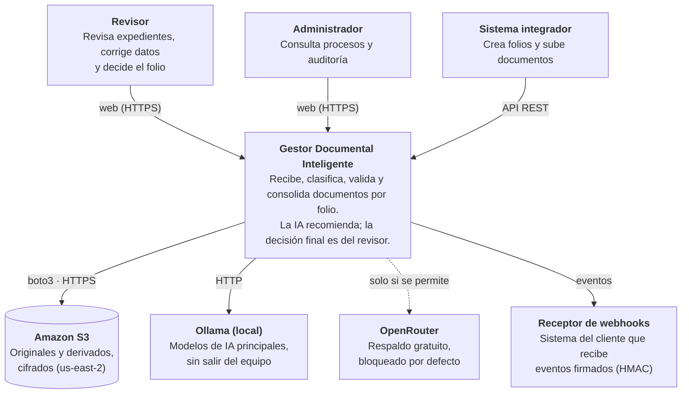
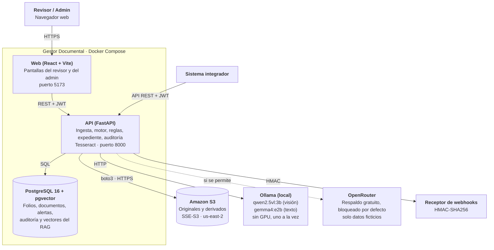
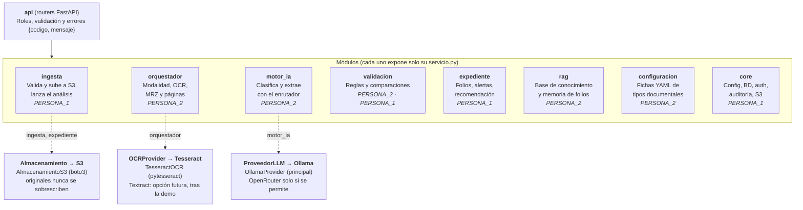
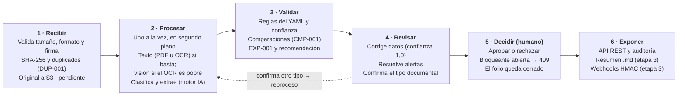

# Arquitectura de solución

Componente configurable que recibe, clasifica, valida y consolida documentos por folio. La IA
recomienda (aprobar o revisión manual) y la decisión final es siempre humana.

Este documento reúne en un solo sitio las vistas, el despliegue, la seguridad y las decisiones que
están repartidas entre los ADR, `docs/arquitectura.md` y `docs/PLAN_PROYECTO.md`. No sustituye a
ninguno: si algo de aquí contradice un ADR o un contrato, prevalecen ellos. Las vistas siguen el
modelo C4 (contexto, contenedores y componentes).

Actualizado: 2026-10-02.

## 1. Objetivo y alcance

Equipo de 2 personas, 14 días (desde el 2026-09-29), todo el código escrito con Claude Code. Caso
de uso inicial: **onboarding** (folios `ONB-AAAA-NNNNNN`) con tres tipos documentales: credencial de
elector, pasaporte y comprobante de domicilio.

| Dentro del MVP | Fuera del MVP |
| --- | --- |
| Carga por web y por API, folio por solicitud | Conectores a terceros |
| Clasificación, extracción y validación con IA, OCR y visión | Aprendizaje automático con las correcciones |
| Reglas deterministas, comparaciones entre documentos y alertas por severidad | Multi-tenant completo |
| Recomendación del expediente y decisión humana. La recomendación global nunca es `rechazar`; la decisión final es siempre humana. | Reprocesar documentos en `error` |
| Originales en S3, resumen `.md` del expediente, API REST y webhooks | Cola de trabajos con varios procesos |
| Memoria de folios (RAG) y base de conocimiento | Edición de procesos: la pantalla de procesos es de solo lectura (`GET /procesos`, recorte R3) |

Reparto: **PERSONA_1** plataforma (ingesta, API, expediente, core), frontend, e2e reales y demo;
**PERSONA_2** motor de IA (configuración, orquestador, motor_ia, reglas), toda la carpeta
`modulos/rag` (base de conocimiento y memoria de folios) y fixtures. PERSONA_3 dejó el equipo el
2026-10-01; su traspaso está en [docs/equipo/PERSONA_3_estado.md](equipo/PERSONA_3_estado.md) (PR #13).

Recortes R1–R9 aceptados en el PR #13 (el MVP no se recorta): ver la
[sección 8 de docs/PLAN_PROYECTO.md](PLAN_PROYECTO.md#8-traspaso-de-persona_3-recortes-y-pr-2026-10-01-revisado-el-2026-10-02).

## 2. C4 nivel 1: contexto

Las personas entran por la web y los sistemas integradores por la API REST. El gestor guarda los
originales en Amazon S3, analiza con modelos locales de Ollama y avisa al cliente con webhooks
firmados. OpenRouter (línea discontinua) solo se usa si se permite expresamente y nunca con datos
reales.

## 3. C4 nivel 2: contenedores

Dentro de Docker Compose hay tres piezas: la web, la API (que incluye Tesseract para el OCR) y
PostgreSQL con pgvector, que guarda datos, auditoría y vectores en una sola base. Fuera quedan S3
(en la nube), Ollama (en el equipo o como perfil opcional), OpenRouter (bloqueado por defecto) y los
sistemas que reciben los webhooks.

## 4. C4 nivel 3: componentes de la API

Monolito modular con puertos y adaptadores (ADR-005). Los routers de `api` solo llaman a los
`servicio.py` de cada módulo; ningún módulo importa ficheros internos de otro. Los servicios externos
se usan siempre a través de una interfaz (puerto), así que cambiar de proveedor (por ejemplo, añadir
Textract al OCR) es añadir un adaptador sin tocar el resto. El detalle de capas y reglas de
dependencia está en `docs/arquitectura.md`.

## 5. Flujo principal

Cada documento entra por la ingesta, se analiza en segundo plano (uno a la vez) y se valida con
reglas deterministas y comparaciones entre documentos. El revisor corrige, resuelve alertas o
confirma otro tipo (que reprocesa el documento como versión nueva) y decide; tras la decisión el
folio queda cerrado.

En el análisis, el motor usa el modelo de texto si hay texto suficiente (la capa de texto del PDF o
el OCR) y pasa a visión ante cualquiera de las cuatro señales de OCR pobre: texto insuficiente
(alguna página con menos de 30 letras), clasificación desconocida, la mitad o más de los campos
obligatorios vacíos, o algún campo con formato imposible. El detalle está en
[docs/motor_ia/EXPLICACION_MOTOR.md](motor_ia/EXPLICACION_MOTOR.md).

La recomendación global nunca es `rechazar`; la decisión final es siempre humana. Como mucho pide
revisión manual. La recomendación por documento la define el motor (PERSONA_2) en la etapa 2.

## 6. Despliegue

Todo se levanta con **Docker Compose** en una máquina del equipo (sin GPU); solo el almacenamiento
de originales está en la nube.

| Pieza | Dónde corre | Notas |
| --- | --- | --- |
| Frontend React + Vite | Contenedor `frontend` (puerto 5173) | En desarrollo usa mocks (msw); el build final no incluye ningún mock |
| API FastAPI | Contenedor `backend` (puerto 8000) | Ejecuta `alembic upgrade head` al arrancar; incluye Tesseract (`spa` + `eng`) |
| PostgreSQL 16 + pgvector | Contenedor `db` (puerto 5432) | Datos, auditoría y vectores del RAG en una sola base |
| Ollama | En el equipo (por defecto) o contenedor opcional (`--profile ollama`) | Modelos `qwen2.5vl:3b` (visión) y `gemma4:e2b` (texto); `OLLAMA_MAX_LOADED_MODELS=1` |
| Amazon S3 | Bucket privado en `us-east-2` | Cifrado SSE-S3, versionado recomendado, CORS solo para la web local |
| OpenRouter | Servicio externo | Respaldo gratuito, **desactivado por defecto** (`PERMITIR_PROVEEDORES_NO_PRIVADOS=false`) |

Configuración por variables de entorno (`.env`, nunca en el repositorio; ver `.env.example`): base
de datos, claves del usuario IAM, zona horaria del negocio, tamaño máximo de archivo (20 MB) y número
de análisis simultáneos (1).

## 7. Seguridad y privacidad

| Control (diapositiva 12) | Cómo se cumple |
| --- | --- |
| Autenticación y roles | JWT con caducidad; roles `admin`, `revisor`, `integrador`; el rol se comprueba contra la base en cada petición. Contraseñas con bcrypt; el login no revela si el usuario existe |
| Cifrado | En reposo: SSE-S3 en cada objeto. En tránsito: HTTPS hacia S3; webhooks solo `https://` en producción |
| Integridad del original | Subida condicional a S3: un original nunca se sobrescribe. El usuario IAM no tiene permiso de borrado. SHA-256 de cada archivo y detección de duplicados |
| Mínimo privilegio | Usuario IAM con `PutObject`, `GetObject` y `ListBucket` sobre un solo bucket |
| Protección de secretos | Claves solo en `.env`; placeholders `TU_CLAVE_AQUI` en ejemplos; no se puede arrancar en producción con valores de ejemplo |
| Trazabilidad | Auditoría de cada acción (login, folio, subida, procesamiento con modelo y versión de prompt, correcciones, alertas, clasificación, decisión) |
| Minimización de datos | Ni la auditoría, ni los mensajes de error, ni las alertas guardan valores personales; los comentarios libres no se auditan |
| Privacidad frente a la IA | Ollama local como principal: los datos no salen. OpenRouter gratuito solo con datos ficticios y bloqueado por defecto |
| Validación humana | La IA solo recomienda. La recomendación global nunca es `rechazar`; la decisión final es siempre humana. Tras decidir, el folio queda cerrado para siempre |
| Datos de prueba | Solo fixtures y especímenes ficticios, sin metadatos (EXIF/GPS eliminados) |

Pendiente (etapa 3, ADR-010): enmascaramiento de datos sensibles en la API según el rol,
con "mostrar" auditado, y filtro de enmascaramiento en los logs.

## 8. Requisitos no funcionales

| Aspecto | Valor actual | Cómo se garantiza |
| --- | --- | --- |
| Tiempo de análisis | 60–250 s por documento en CPU | Procesamiento en segundo plano; la UI sondea el estado (3–15 s, se detiene a los 10 min) |
| Concurrencia del motor | 1 análisis a la vez (configurable) | Semáforo alrededor de la llamada al motor, para no agotar la RAM |
| Numeración de folios | Sin huecos ni duplicados | Contador por proceso y año con una sola sentencia SQL; probado con 20 peticiones simultáneas |
| Decisión concurrente | Solo un revisor gana | Actualización condicional del folio; probado con 2 hilos |
| Tamaño de archivo | Máximo 20 MB | Lectura limitada antes de cargar en memoria (`413`) |
| Paginación | Folios 20, auditoría 50 (máx. 100) | Contrato 2 y ADR-008 |
| Calidad | e2e contra la API 15/15; frontend con Vitest 177 y Playwright 10 sobre mocks; pytest del backend en `main` 400 pasados y 2 omitidos. Cifras de la revisión del PR #12 (2026-10-02, antes del #11) | Tests en cada commit; pruebas reales contra el bucket |
| Límites conocidos | Un solo proceso de servidor | Con varios procesos haría falta una cola (fuera del MVP) |

## 9. Integración y contratos

Tres contratos congelados que solo cambian con un ADR y aviso al equipo:

1. **Contrato 1, `backend/app/schemas/resultado.py`:** el JSON de resultado (`ResultadoDocumento`,
   `ResultadoExpediente`, `ResumenFolio`), en snake_case y en español, idéntico a la diapositiva 7.
2. **Contrato 2, `docs/contratos/endpoints.md`:** API REST bajo `/api/v1` con Bearer JWT; errores
   siempre `{codigo, mensaje}` con catálogo propio (`codigos_error.md`).
3. **Contrato 3, `backend/app/modulos/motor_ia/interfaces.py`:** interfaz interna del motor
   (`ProveedorLLM`, `Enrutador`).

Además, la interfaz plataforma–motor acordada entre PERSONA_1 y PERSONA_2 ([sección 11 de
`docs/motor_ia/SPEC_CONFIGURACION.md`](motor_ia/SPEC_CONFIGURACION.md#11-integracion-con-la-plataforma-etapa-2)):
`procesar_documento(contenido, *, identificador, nombre_archivo, tipo_declarado, folio, referencia, tipo_confirmado=None) -> (ResultadoDocumento, datos_auditoria)`.
El motor no toca la base de datos ni S3.

**Salida hacia otros sistemas:** API REST (consulta de folios, documentos, resumen y auditoría) y
**webhooks por proceso** firmados con HMAC-SHA256 (`X-Firma`), con los eventos
`documento.completado`, `documento.error` y `folio.estado_cambiado` (etapa 3).

**Catálogos de referencia** (no congelados): `docs/contratos/codigos_alertas.md` (CLS, VAL, REG, DUP,
CMP, EXP, SYS, VIS) y `docs/contratos/codigos_error.md`.

## 10. Costes

El proyecto no tiene presupuesto para IA (ADR-003): todo lo que puede ser local, lo es.

| Elemento | Coste | Comentario |
| --- | --- | --- |
| Ollama, Tesseract, PostgreSQL, FastAPI, React | Sin coste | Software libre en máquinas del equipo |
| Amazon S3 | Muy bajo con datos de prueba | Almacenamiento y peticiones; único servicio de pago hoy |
| OpenRouter | Sin coste | Solo modelos gratuitos (`:free`) y bloqueado por defecto |
| Amazon Textract (opción futura) | Por página procesada | Solo después de la demo; necesita su propio ADR y presupuesto (sección 12) |
| Claude Code | Suscripción de empresa existente | Herramienta de desarrollo, no forma parte del producto |

## 11. Decisiones de arquitectura

Cada decisión está registrada como ADR en `docs/adr/`.

| ADR | Decisión | Estado |
| --- | --- | --- |
| ADR-001 | Stack: Python 3.12 + FastAPI, React 18 + Vite, PostgreSQL 16 + pgvector, Amazon S3 real (sin MinIO), Tesseract tras `OCRProvider`, Docker Compose | Aceptado |
| ADR-002 | Tres contratos congelados; folio `{PREFIJO}-{AAAA}-{NNNNNN}`; severidades y recomendaciones fijas | Aceptado |
| ADR-003 | Ollama principal (datos locales); OpenRouter gratuito como respaldo solo con datos ficticios; sin presupuesto | Aceptado |
| ADR-004 | `referencia_externa` y `fecha_solicitud` en el expediente (identificador opaco, nunca el nombre) | Aceptado |
| ADR-005 | Monolito modular con puertos y adaptadores; cada módulo expone solo su `servicio.py` | Aceptado |
| ADR-006 | Huecos del contrato para la UI del revisor: lista de folios, `id` de alerta, catálogo de errores, resolución de alertas, correcciones, reproceso, folio cerrado | Aceptado |
| ADR-007 | La confianza de campo y de clasificación la calcula el código, no el modelo | Aceptado |
| ADR-008 | Auditoría paginada y `referencia_externa` en la lista de folios | Aceptado |
| ADR-009 | Valor reservado `desconocido` en `tipo_documental_detectado` | Propuesto (PR #14) |
| ADR-010 | Etapa 3: enmascaramiento en la API con "mostrar" auditado, edición de procesos y forma de los antecedentes | Reservado; borrador el día 7 (PERSONA_1) |

## 12. Riesgos y mejoras propuestas

| Riesgo | Impacto | Mitigación |
| --- | --- | --- |
| Ollama sin GPU | Cada documento tarda 1–4 min | Modelos pequeños, un análisis a la vez, procesamiento en segundo plano |
| OCR con fotos de móvil | Tesseract lee el 85 % de los campos de los especímenes, pero 0/4 en el comprobante difícil | El motor pasa a visión cuando el OCR es pobre; Textract queda como opción futura (abajo) |
| Confianza del modelo poco fiable | Alertas de confianza que nunca saltarían | ADR-007: la confianza la calcula el código |
| Un solo proceso de servidor | El semáforo no coordina varios procesos | Suficiente para el MVP; cola de trabajos si se escala |
| Especímenes con fechas fijas | Desde el 2026-12-14 el comprobante da una alerta crítica de antigüedad | Reimprimir y fotografiar si se usan después de esa fecha |
| Cambios de contrato a mitad de proyecto | Romperían el trabajo de los demás | Contratos congelados, cambios solo por ADR y PR revisado |

### Opción futura: Amazon Textract como respaldo del OCR

Queda como opción para después de la demo, no para el MVP.

- **Hoy no hace falta:** la visión ya cubre el OCR pobre. En los fixtures difíciles y extremos, con
  la regla de las cuatro señales, el motor acierta 31/34 campos en difícil y 28/34 en extremo
  (sección 5 de [docs/motor_ia/EXPLICACION_MOTOR.md](motor_ia/EXPLICACION_MOTOR.md) y
  `docs/motor_ia/pruebas_ollama/resultados/evaluacion/informe.md`).
- **Necesitaría su propio ADR:** toca el puerto `OCRProvider` (`extraer_texto(imagen) -> str`, un
  adaptador `TextractOCR` nuevo), tiene coste por página (el proyecto no tiene presupuesto de IA) y
  envía los documentos a un servicio de AWS para analizarlos.
- **Privacidad:** tendría que pasar por la misma barrera que OpenRouter
  (`PERMITIR_PROVEEDORES_NO_PRIVADOS`): bloqueado por defecto y solo con datos ficticios.
- **Otros límites:** permiso IAM nuevo (`textract:DetectDocumentText`, que la organización podría
  bloquear) y su modo de identidad (AnalyzeID) no reconoce la credencial de elector mexicana.

### Propuesta: documentación en C4

Las vistas de este documento siguen el modelo C4. Se propone que `docs/arquitectura.md` enlace a
ellas en vez de mantener su diagrama único, que mezcla niveles.

## 13. Estado actual del desarrollo

A 2026-10-02. Cada persona trabaja en su rama y se integra en `main` por PR revisado por otra persona
al cerrar cada etapa. Los PR #10, #11, #12, #13 y #15 están fusionados; el #14 (ADR-009) está abierto.

| Rama | Persona | Estado |
| --- | --- | --- |
| `main` | — | Contratos, catálogos, ADR-001 a ADR-008, las etapas 1 y 2 de la plataforma (PR #3 y #9), el frontend (PR #10), la etapa 1 del motor (PR #11), este documento (PR #12 y #15) y el traspaso de PERSONA_3 (PR #13) |
| `feat/plataforma` | PERSONA_1 | Etapa 2 fusionada; probada de extremo a extremo (15/15). También el frontend heredado (H1–H8, H16, H17, H19) |
| `feat/motor-ia` | PERSONA_2 | Etapa 1 del motor (configuración, OCR, MRZ, preparador, Ollama, enrutador, servicio y CLI); PR #11 fusionado. También `rag` y los fixtures heredados (H9–H15) |
| `feat/interfaz` | — | Sin uso; su contenido está en `main` (PR #10) |

**Siguiente:** conectar el motor real (`procesar_documento`, etapa 2 de
PERSONA_2) y `configuracion` en la plataforma; hito de la etapa 2 (subir documentos por la web y
verlos clasificados, extraídos y validados); etapa 3 (resumen `.md`, webhooks, RAG, enmascaramiento).

## 14. Fuentes

- `docs/PLAN_PROYECTO.md`: plan, decisiones y etapas
- `docs/arquitectura.md`: arquitectura de software (ADR-005)
- `docs/adr/ADR-001` a `ADR-008`
- `docs/contratos/endpoints.md`, `codigos_error.md`, `codigos_alertas.md`
- `backend/app/schemas/resultado.py` y `backend/app/modulos/motor_ia/interfaces.py`
- `docs/motor_ia/SPEC_CONFIGURACION.md` (PERSONA_2) y `docs/equipo/PERSONA_1_estado.md`
- Presentación "Gestor Documental Inteligente con IA" (diapositivas 2 a 14)
